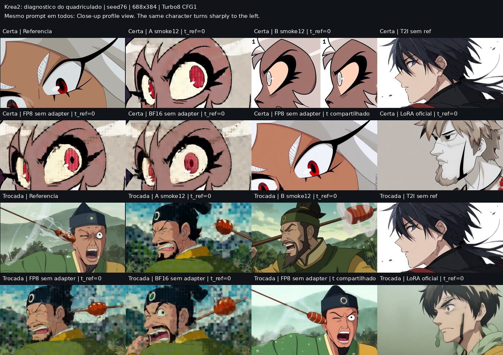
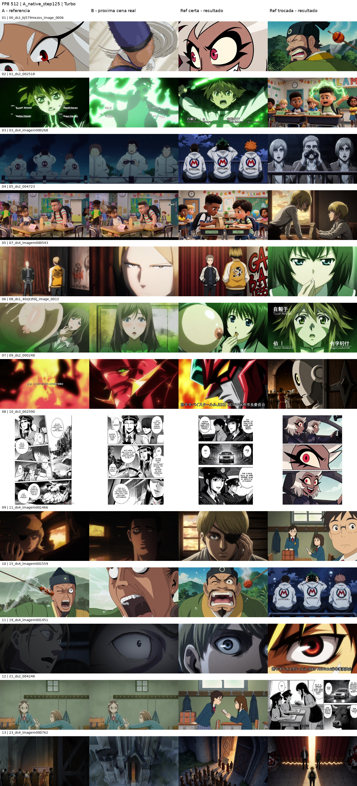
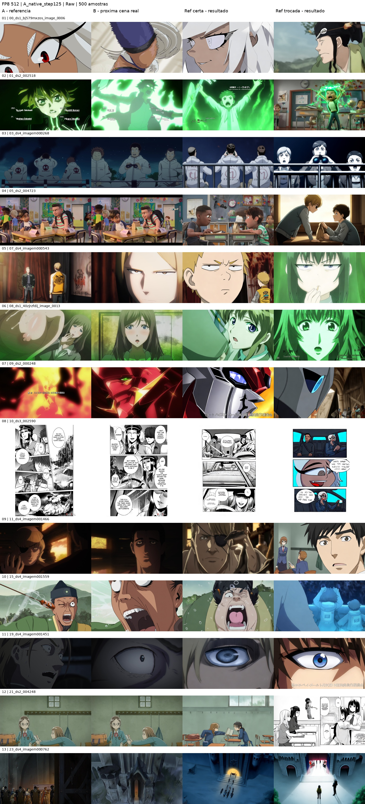

# Krea 2 — diagnóstico do smoke nativo

**Este grid é diagnóstico de um único held-out, não ranking dos métodos.**
Mesmo prompt, seed76, 688×384, Euler/Turbo8/CFG1. Duas primeiras linhas: referência
certa; duas últimas: referência trocada. O T2I não usa imagem e se repete nas duas
condições. A e B são smokes de12 steps, não os probes novos de500.

O quadriculado existe no A12 e na base sem adapter usando `index_timestep_zero`.
Repetir com BF16, ref~1MP ou Raw28 também produz o padrão. T2I sai limpo. `index`
(timestep compartilhado) sai limpo, mas copia a referência. O controle positivo
com o LoRA oficial `Comfy-Org/Krea-2/loras/krea2_style_reference.safetensors`, no
mesmo caminho `index_timestep_zero`, sai limpo e gera nova pose.

A inferência provisória é que o contrato zero precisa de um adapter já adaptado;
12 steps não demonstram convergência. Não trocar o timestep só na inferência de
um adapter treinado com zero. O probe A começa do zero, sem A74 ou pesos do
smoke, e sua avaliação125 deve ser inspecionada antes de continuar até500.

[Paridade GPU real](gpu_forward_parity.json): BF16, mesmo modelo/inputs nos dois
forwards, relL2≈0,0067 em zero e≈0,0065 em index; ambos finitos. CPU tiny e
encoder real passaram anteriormente. Não afirmar identidade bit a bit em BF16.

PNGs completos, workflows API, Raw e logs em
`/workspace/k2ab/artifacts/fp8_512/diagnostic`, com backup no HF privado
`AdwolfCzar/krea2-ab-runs/artifacts/fp8_512/diagnostic`. Receita/log:
[run log](../../KREA2_AB_RUN_LOG.md).

## Primeiro probe A — 125 steps / 500 amostras

Treino novo, do zero, sem A74 e sem adapters smoke. Nos13held-out com ref certa
e trocada (26imagens por variante), o quadriculado do smoke não aparece. O Raw
muda mais o enquadramento em alguns casos; o Turbo ainda repete a pose da ref,
notadamente os personagens de costas à noite. Ambos respondem fortemente ao
shuffle. Esse resultado libera a continuação autorizada até500, não escolhe
vencedor nem prova que a tarefa foi resolvida.

Métricas de triagem: Turbo ref_gain0,0705/gt0,4746; Raw ref_gain0,0922/gt0,5307.
copy_rate(dHash)=0 em ambos não detecta por si só a repetição de composição.
JSONs completos ao lado dos grids.

Auditoria Raw no A125 **micro2** (não confundir com A125 micro4 anterior): [grid de CFG/steps](A125_micro2_Raw_settings_grid.jpg), [auditoria oficial](A125_micro2_Raw_configuration_audit.json), [parâmetros completos](A125_micro2_Raw_settings_manifest.json). As três linhas usam a mesma seed, checkpoint, prompt e referência. Nenhuma variante mostrou melhora consistente; Raw28/CFG5.5 permanece no A/B.

A500/A750 micro2, Turbo com adapter apenas: [A500 512](A500_micro2_Turbo_sampling512.jpg), [A500 1024](A500_micro2_Turbo_sampling1024.jpg), [A750 512](A750_micro2_Turbo_sampling512.jpg), [A750 1024](A750_micro2_Turbo_sampling1024.jpg). Dois casos fixos, mesma seed. A750/512 quase copia a referência em ambos; 1024 altera o mecha, mas noite continua próxima da referência. Métricas JSON adjacentes. Meta ampliada para1000 por braço, monitoramento em andamento; sem eleger vencedor.

A1000 micro2: [Turbo512](A1000_micro2_Turbo_sampling512.jpg), [Turbo1024](A1000_micro2_Turbo_sampling1024.jpg). Noite agora frontal com binóculo, preservando ambiente; mecha muda enquadramento mas troca vermelho por amarelo. B ainda em andamento; comparação de dois exemplos não elege vencedor.
