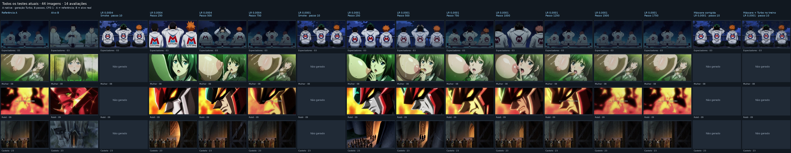
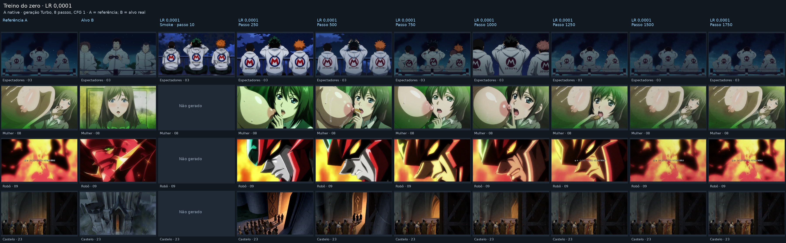
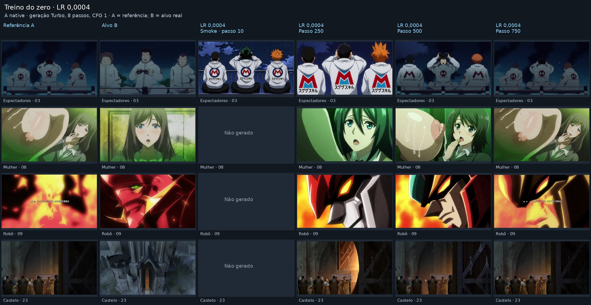
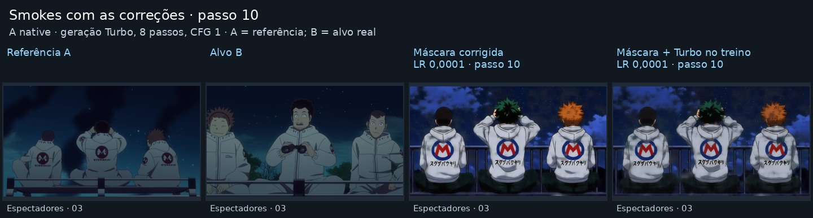

# Galeria A native — 2026-10-01

44 imagens de 14 avaliações das duas execuções novas e seus quatro smokes. Todas usam Turbo 8 passos, CFG 1. Os smokes corrigidos são do passo 10. Referência A e alvo B aparecem nas duas primeiras colunas. Células vazias são marcadas como “Não gerado”.

[Galeria pública, PNGs completos e 44 originais](https://huggingface.co/AdwolfCzar/krea2-a-native-lr0001/blob/main/gallery/README.md)

Reproduzir: `python tools/krea2_samples_gallery.py --output /workspace/k2ab/artifacts/gallery_20261001`. O manifesto preserva os caminhos de origem e SHA256 de cada imagem. Não inclui testes históricos anteriores às duas campanhas novas.
