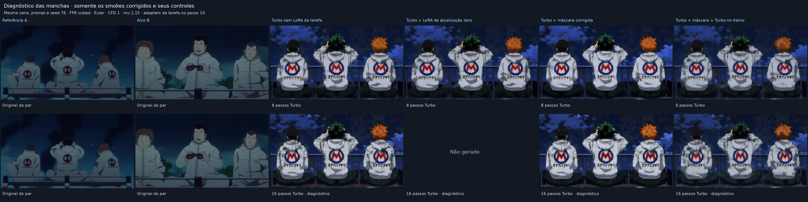

# Investigação das manchas após a correção de padding

Este diretório reúne as evidências solicitadas para revisão por outro agente. O foco são **os dois smokes da correção de máscara**, não as campanhas históricas. Nenhum treinamento adicional foi iniciado nesta investigação. O treino longo permanece parado em 1949; os dois smokes anteriores fizeram 10 passos e resume até 12, mas suas imagens são do passo 10.

## O que foi observado e o que se pode concluir

1. As manchas estão nas imagens PNG originais, especialmente nas roupas e na parte inferior. Não foram introduzidas pelo grid.
2. **O controle Turbo sem LoRA da tarefa também tem manchas**, com a mesma referência, prompt, seed 76, resolução 688×384, sampler Euler, CFG 1, mu 1,15 e 8 passos. Isso impede atribuir a origem das manchas exclusivamente à máscara corrigida ou aos dez passos novos de treino.
3. Uma LoRA de diagnóstico com atualização exatamente zero, cobrindo os mesmos 256 módulos, produziu pixels **idênticos** ao controle sem LoRA da tarefa: MAE0, máximo0. O controle usa rank 1 com A/B zero; não é um adapter treinado. Isso testa um patch de atualização nula, não a composição de updates não nulos ou a quantização após somar Turbo e a tarefa.
4. Com 16 passos Turbo, as manchas **continuam visualmente presentes**, tanto na base quanto nos dois adapters. Esta observação usa uma cena/seed e não estima qualidade geral. Não se recomenda mudar o número de passos a partir deste teste.
5. Foi confirmada outra diferença numérica: o wrapper `ScaledFP8Linear` preservava os códigos e escalas dos pesos, mas fazia **todas** as multiplicações em BF16. O ComfyUI usa multiplicação quantizada em FP8 em camadas elegíveis e BF16 nas camadas marcadas `full_precision_matrix_mult`. Logo, as afirmações anteriores de equivalência numérica completa ao stock eram excessivas.

Não está provado que essa diferença numérica causa as manchas. O controle visual sem LoRA já apresenta o defeito, e os resultados abaixo são de camadas isoladas, não do DiT inteiro.

## Medição com os pesos reais

Entradas sintéticas de 32 tokens, seed 76, RTX 5090, pesos do mesmo checkpoint FP8 scaled. Erro relativo L2 calculado contra o módulo real do ComfyUI.

| Módulo | Política stock | Output legado BF16 | Gradiente da entrada legado | Output após patch | Gradiente após patch |
| --- | --- | ---: | ---: | ---: | ---: |
| blocks.0.attn.wq | FP8 | 0,0273545 | 0,0277023 | 0 | 0 |
| blocks.0.attn.gate | BF16 | 0 | 0 | 0 | 0 |
| txtfusion.refiner_blocks.0.attn.wq | FP8 | 0,0266517 | 0,0266245 | 0 | 0 |

Nos três casos, o forward quantizado do ComfyUI com autograd e sem autograd também foi idêntico. JSONs e logs preservam os valores sem arredondamento na pasta `measurements`.

## Patch disponível para revisão

- [models/base.py](../../../../models/base.py): modo explícito `fp8_scaled_matmul='comfy'`, preservando a política por camada, escalas e códigosFP8. Usa `comfy.ops.QuantLinearFunc` para forward quantizado/backward em precisão de cálculo. PEFT continua como ramo treinável separado. O modo legado `'bf16'` continua disponível.
- [models/krea2_native.py](../../../../models/krea2_native.py): registra a política na metadata. **O default permanece `'bf16'` para manter as execuções existentes reproduzíveis.** O patch novo não foi usado para gerar as imagens dos smokes ou dos controles deste diretório.
- [test/test_scaled_fp8_comfy.py](../../../../test/test_scaled_fp8_comfy.py): compara forward e gradiente contra o ComfyUI em GPU, cobre as duas políticas por camada, checkpointing ligado/desligado e backward de A/B PEFT com peso-base congelado em FP8.
- [tools/krea2_fp8_linear_audit.py](../../../../tools/krea2_fp8_linear_audit.py): auditoria reproduzível das camadas reais.
- [tools/krea2_noise_probe.py](../../../../tools/krea2_noise_probe.py): geração dos controles Turbo 16, sem iniciar treino.

**Limite da validação:** ainda falta validar o forward/gradiente do modelo inteiro, o ciclo real DeepSpeed, a composição dos adapters na inferência e a qualidade visual usando o modo novo. Não há autorização técnica para declarar esse patch uma solução visual ou escolher Turbo congelado como receita vencedora.

## Como ler as imagens

[Grid em PNG, resolução completa](grid_diagnostico.png). Linha superior:8 passos; inferior:16 passos. Cada coluna mantém os mesmos pesos da tarefa. As duas primeiras mostram a referênciaA e o alvoB. A coluna LoRA zero não foi gerada a16 passos. Todos os PNGs originais e workflows estão em `images`; não há filtros ou denoise de pós-processamento.



## Evidências da tarefa anterior

`previous_correction_audit` contém configurações, logs dos quatro jobs 10/12, CSVs de VRAM, relatórios e todos os JSONs/logs de paridade anteriores. Os gates de gradiente real **não passaram**, inclusive controles. As imagens de cada smoke e seus workflows estão em `images/original_smokes`. Os arquivos de checkpoint grandes permanecem no [HF público](https://huggingface.co/AdwolfCzar/krea2-a-native-lr0001/tree/main/checkpoints), com identidade/SHA256 dos inputs em `input_artifacts.json`; não são substituídos por resumos no Git.

Uma falha desta investigação foi preservada em `measurements/regression_tests.log`: o teste novo tentou construir uma classe interna de PEFT sem o argumento `config` exigido pela versão instalada. A implementação do teste foi corrigida para usar `get_peft_model`/`LoraConfig`. O resultado final está em `measurements/regression_tests_corrected.log`: **22 testes passaram** (18 regressões existentes e 4 novos casos GPU).

## Reprodução

ComfyUI deve ser o mesmo checkout usado na inferência. Os arquivos `environment.json`, `jobs` e `input_artifacts.json` identificam versões, argumentos e pesos. Exemplos na instância original:

```bash
/venv/main/bin/python tools/krea2_fp8_linear_audit.py \
  --train-repo /workspace/diffusion-pipe-easycontrol \
  --comfy /workspace/k2ab/native_worktree/submodules/ComfyUI \
  --checkpoint /workspace/models/krea2/diffusion_models/krea2_raw_fp8_scaled.safetensors \
  --matmul bf16 --out /tmp/fp8_legacy.json

/venv/main/bin/python tools/krea2_fp8_linear_audit.py \
  --train-repo /workspace/diffusion-pipe-easycontrol \
  --comfy /workspace/k2ab/native_worktree/submodules/ComfyUI \
  --checkpoint /workspace/models/krea2/diffusion_models/krea2_raw_fp8_scaled.safetensors \
  --matmul comfy --out /tmp/fp8_corrected.json

KREA2_STOCK_COMFY=/workspace/k2ab/native_worktree/submodules/ComfyUI \
  /venv/main/bin/python -m pytest test/test_scaled_fp8_comfy.py \
  test/test_krea2_native.py test/test_krea2_text_padding.py \
  test/test_krea2_reference_contract.py -q
```

Os workflows JSON podem ser enviados ao ComfyUI stock via `/prompt` com o respectivo PNG/JPEG de referência e os mesmos arquivos de pesos. A geração anterior dos smokes utilizou **o wrapper legado BF16**, mesmo tendo armazenamento FP8; sua metadata não continha a política de matmul, que agora é explícita.

## Fonte oficial consultada

O [repositório oficial da Krea](https://github.com/krea-ai/krea-2) recomenda treinar LoRA no Raw e aplicar no Turbo, além de Turbo 8 sem CFG e mu 1,15. Portanto, treinar diretamente sobre Turbo congelado com a mesma loss de flow foi um experimento, não uma correção obrigatória sustentada pela recomendação oficial. A documentação descreve principalmente texto→imagem; ela não prova qualidade desse caminho de referência na nossa cena.

`MANIFEST_SHA256.json` identifica os arquivos deste pacote. As imagens e logs são evidências, não uma conclusão causal sobre o dataset ou a máscara.

O arquivo `diagnostic_zero.safetensors` contém o controle de atualização nula (7,2 MB), com SHA256 no inventário. Os adapters treinados de 436 MB não cabem como arquivos comuns no GitHub; seus links públicos exatos e SHA256 estão em `input_artifacts.json`.
