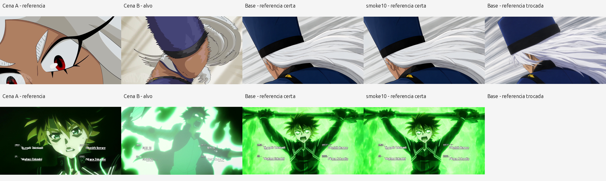
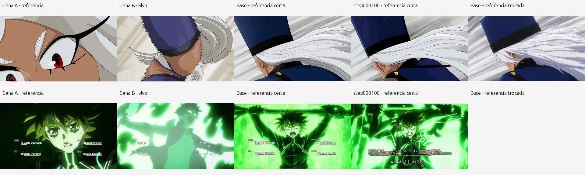

# Native Qwen Image 2.1 Edit — full NextScene dataset

The Anima run was stopped and saved at step **1830** before switching frameworks.
All remaining Anima experiments/checkpoints and result artifacts were uploaded to
[the public archive](https://huggingface.co/AdwolfCzar/anima-nextscene-archive),
then verified against remote SHA256/Git blob hashes before local checkpoint deletion.
The regenerable 37.70 GiB Anima cache was removed. The E2 A winner and final
step-1830 adapter remain in `/workspace/qwen21/anima_preserved`.

## Native editing support and pinned implementation

This run uses **DiffSynth-Studio**, not diffusion-pipe's training implementation.
The original [Qwen21 edit example](https://github.com/modelscope/DiffSynth-Studio/blob/974cfa37f27ac55eba3b6d10efa21f876900572d/examples/qwen_image_21/model_training/lora/Qwen-Image-2.1.sh)
loads **Qwen/Qwen-Image-2.1** with `data_file_keys=image,edit_image` and
`extra_inputs=edit_image`. The commented edit variant reuses an example dataset
folder named `Edit-2511`; its **model** is the new 2.1, not 2511.

Pinned DiffSynth commit: `974cfa37f27ac55eba3b6d10efa21f876900572d`.
Pinned original model revision: `d26bb61231c349cf6b7896fa83353113880e1ba3`.
Every downloaded LFS model file was SHA256 checked; see `model_provenance.json`.
The **new 2.1 RGBA / 64-channel / stride-16 VAE** is loaded from this model repo.
Neither the Krea/Anima VAE nor Comfy-Org convrot weights were substituted.

`tools/qwen21_native.py` imports the upstream `QwenImage21TrainingModule`.
It keeps its native preprocessing, DiT, masks, timestep modulation, scheduler,
and `FlowMatchSFTLoss`. Its operational loop adds full optimizer/RNG resume,
FP32 adapter parameters, warmup/cosine LR, lossless cache storage, audits and
graceful `save_quit`; it does not replace the model/loss with diffusion-pipe.

## Entire available dataset and recipe

| Subset | Complete training pairs |
|---|---:|
| ds1_recortados | 2796 |
| ds2_poxima_v2 | 4594 |
| ds3_comikontext | 2887 |
| ds4_contexto_curado | 1249 |
| Total | **11526** |

24 established heldout pairs remain excluded, as in the previous Anima inventory.
51 targets lack a unique scene-A partner. These are technical exclusions only:
no semantic filters, similarity cuts, per-subset quota or sample cap.

Each pair is **scene B target + scene A reference + one untouched original caption**.
The Anima full/short/short caption repetitions are not carried into native Qwen.
Dataset repeat is **1**, with **three complete shuffled epochs**: **34578 updates**.
Each epoch's permutation includes every eligible pair exactly once.

- 1024-equivalent pixel area, preserving each target's aspect ratio; dimensions
  divisible by 32. For example, 1376×768 is an approximately 1024-area bucket.
- Native real batch **1**, accumulation **1**. The upstream loader uses `x[0]`
  and the reference model function constructs a batch-1 target mask/shape list;
  increasing a CLI batch number would not implement correct native batching.
- DiT base: DiffSynth's differentiable **`comfy_kitchen_fp8_w8a8`** quantization,
  starting from the verified original BF16 weights; FP8 weights retain their scales.
  No unscaled recast of a pre-existing scaled checkpoint.
- BF16 compute/features, **FP32 LoRA parameters and AdamW moments** to preserve
  small adapter updates. Quantization backend implements its native FP8 backward.
- Rank/alpha **32/32**. Native autodetection patches attention q/k/v/out and
  MLP proj/out/gate in all 32 blocks: **448 tensors / 83,886,080 parameters**.
- Peak LR **1e-4**, 200-update warmup, cosine decay to **1e-5**, AdamW decay 0.01,
  gradient norm clipping 1.0, gradient checkpointing enabled.
- Seed 76. The long run initializes a **fresh** LoRA; it does not reuse either smoke.

## Confirmed upstream encoder leak and correction

The pinned text encoder registered a hook on the final language-model norm on
every forward without removing it. Each closure retained that call's pre-norm
hidden tensor. A full multimodal cache would therefore accumulate hooks and GPU
features across thousands of references.

`upstream_text_encoder_hook_cleanup.patch` adds `handle.remove()` in `finally`.
It changes hook lifetime only; the returned pre-norm representation stays the
same. Every cache forward asserts that the hook count has not increased.
Apply this patch to the pinned upstream checkout before preprocessing.

## Evidence and limits

| Check | Result |
|---|---|
| Real FP8 512 smoke | 10 finite-loss/backward/AdamW updates |
| LoRA change | All **224 A and 224 B tensors** changed |
| Real model checkpointing, trained nonzero adapter | Output max error **0**; relative gradient error **0** in blocks 0 and 31, 28 gradient tensors |
| Full resume replay | Step 10 → 12 repeated; **all 448 weight tensors bit-identical** |
| Native 1024 smoke | 10 updates; **0.2205 pair/s including cold shape compilation**, approximately **0.238 pair/s** after warmup |
| 1024 peak PyTorch allocated memory | **13.295 GiB**; whole-process GPU usage is higher |
| Native heldout image smoke | 2 matched references and 1 shuffled reference, before/after step 10 |

The uncheckpointed full 512 graph initially ran out of 32GB VRAM. The diagnostic
was corrected to store **plain saved autograd tensors on CPU**, while keeping
quantized tensors on GPU. The generic `save_on_cpu` hook also failed because this
comfy-kitchen release cannot copy QuantizedTensor into a plain CPU tensor. The
custom storage hook avoids that operation; no model/backward formula was changed.
These failures were diagnostics, not long training attempts.

Initial resume verification compared the SafeTensors **file** SHA, which differed
because metadata key order is not canonical. Comparing all actual tensor values
proved bit-identical replay. Upload verification still compares exact file hashes.

The forward parity measurement covers the complete model output, while the
gradient comparison covers the first and last blocks. It is not a comparison
against unquantized BF16, ComfyUI, or a proof of final image quality.

Sampling uses native model/scheduler/40 steps/CFG 1/seed 76. Its optional prefix
KV cache is **disabled**: tensorwise FP8 activation scales depend on the token
group, and dropping cached prefix tokens can change those scales. This keeps
the full-token numerical path used by training. Target latents are used only for
output shape in the diagnostic sampler; generation begins with fresh noise.

The step-10 images demonstrate execution, reference conditioning and a nonzero
adapter effect. They do **not** establish better quality or solved NextScene
generalization. Original PNGs and captions/paths are in `samples/`.

The fresh long run reached **100**, saved and verified its full state on the
public Hub, generated its preview, and resumed past **120**. See
`step100_report.json` and the checkpoint/sample verification receipts. This
checks the automated train → backup → sample → resume cycle in production.

## Operation and storage

Supervisor service: **qwen21_training**. Working directory `/workspace/qwen21`.
First preview/checkpoint at 100, then every 250 updates and each epoch boundary.
At each epoch, all **24 heldout pairs** are evaluated with correct and shuffled
references; the frequent preview uses three cases. Full optimizer, scheduler,
CPU/CUDA/Python/NumPy RNG and exact global dataset position are saved.

The first epoch encodes ahead by training stage, not by dataset selection. Native
reference latents **and image-conditioned Qwen3-VL representations** are cached.
Compact caches discard only dead PIL/noise fields after native preprocessing;
native flow loss generates fresh noise and timestep on every update.
Zstandard roundtrips are tensor-bit-identical.

Measured compressed cache is approximately **8 MB/pair**, so the full cache can
exceed the available disk. Disk retains a 12 GiB checkpoint reserve; additional
**regenerable** features spill to `/dev/shm/qwen21_cache` (61 GiB shared-memory
capacity). RAM cache is temporary and missing items are recomputed after restart.
Canonical images/captions and saved model states do not live only in shared memory.
Cache identity is bound to the dataset metadata digest and encoder revision.

Public results: [Qwen21 NextScene Edit](https://huggingface.co/AdwolfCzar/qwen-image-21-nextscene-edit).
Uploads are verified before pruning; the latest two full training checkpoints
remain locally. Older uploaded checkpoints stay on the Hub. An acknowledged job
failure stops with a `failed` status instead of repeating an expensive GPU loop.

Graceful stop: `touch /workspace/qwen21/save_quit`; do not SIGTERM the trainer.
Restart the supervisor service after removing that marker to restore the full state.
The three epochs take approximately **40 hours of updates** at the smoke rate,
plus encoding, uploads and evaluations; this is an estimate, not a completion claim.

Live loss: `/workspace/qwen21/checkpoints/loss.jsonl`.
Phase/last saved checkpoint: `/workspace/qwen21/campaign_state.json`.
Per-update progress: `/workspace/qwen21/progress.json`.
